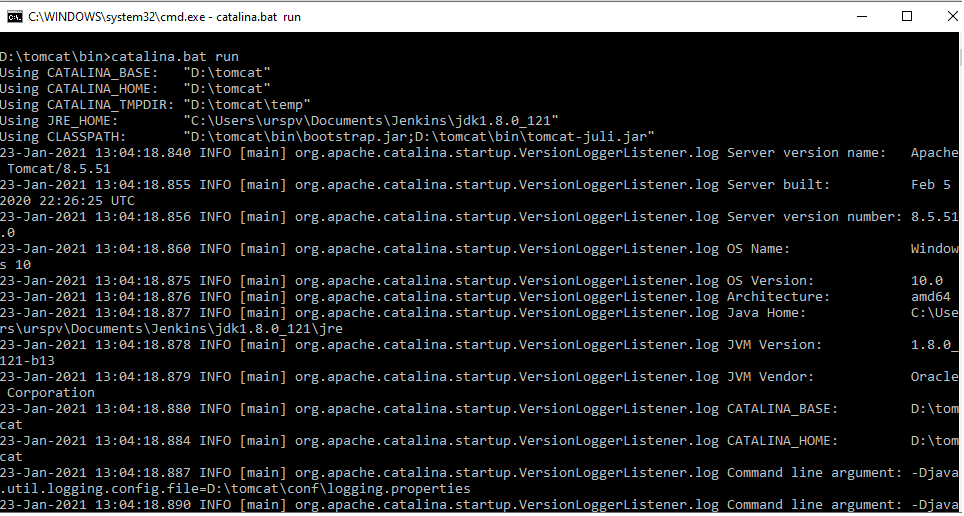
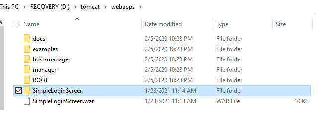
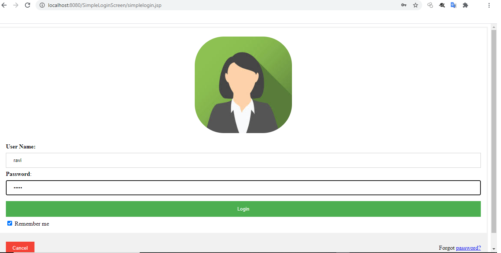
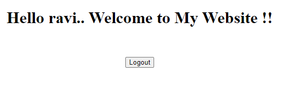
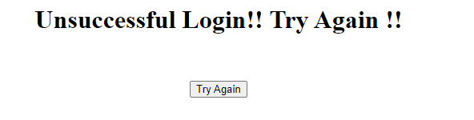

# Steps to be followed:
1) Install tomcat server, if it is not in your system. The link for installing tomcat is https://archive.apache.org/dist/tomcat/tomcat-8/v8.5.51/bin/apache-tomcat-8.5.51.zip
2) Pick the war file(SimpleLoginScreen.war) loaded in this github path and store it in your system
3) Upload the war file in the tomcat's webapps folder
4) Start the tomcat server by running the command "catalina.bat run" from the commandline prompt. Eg:D:\>tomcat\bin\catalina.bat run

5) We can see a folder created with all the files after war file deployment

6) Now open a browser and run http://localhost:8080/<war file name>/<initial html/jsp/servlet file name>. Eg:http://localhost:8080/SimpleLoginScreen/simplelogin.jsp
  
7) After entering the login/pwd values as ravi/kumar (we can change these credentials in the UserLoginCheck.java code), we can see the success screen. Otherwise, a failure login screen appears.

# Below is the process to open and run the java code from Eclipse EE editor.
(a) The source code(SimpleLoginScreen.zip) for this java application is given in the github link. To open the code, we need Eclipse EE editor(https://www.eclipse.org/downloads/download.php?file=/technology/epp/downloads/release/2020-12/R/eclipse-jee-2020-12-R-win32-x86_64.zip) and the java path setup is required.

(b) After downloading the zip file from github, extract the files in the system to use it in Eclipse.

(c) After launching Eclipse editor, click File -> Open projects from file system and select the previous folder(SimpleLoginScreen) and we can see the java project (Dynamic Web).

(d) Under Java Resources > src folder, we can see the java files. All other jsp, img files can be checked from WebContent folder.

(e) We can run this project from Eclipse by using tomcat. For that, right click on the project and select Run on Server and we can see the login screen running from Eclipse.

(f) If no screen comes up in Eclipse then ensure the URL:http://localhost:port/SimpleLoginScreen/simplelogin.jsp is formed in the editor or not.

